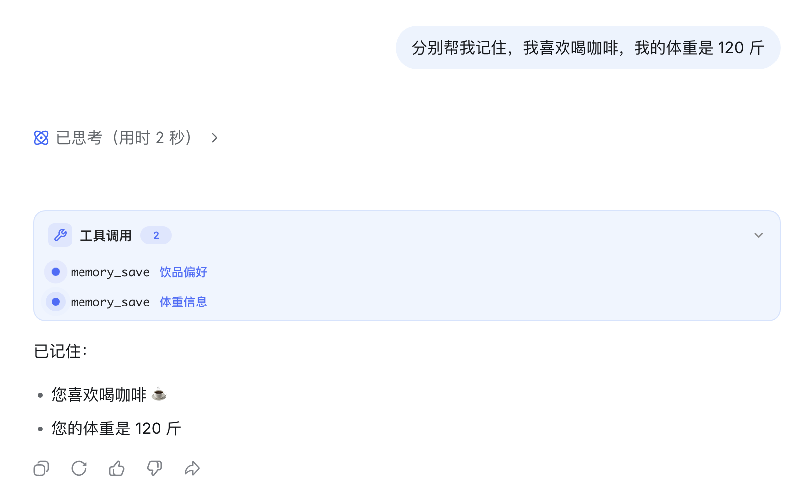
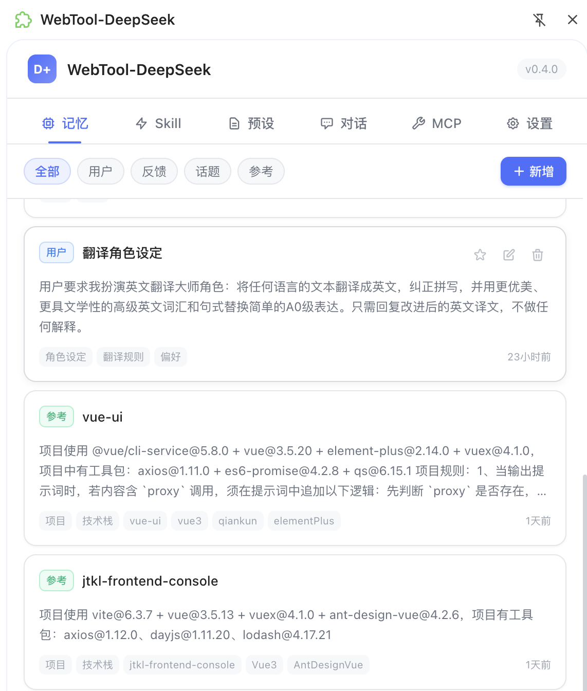
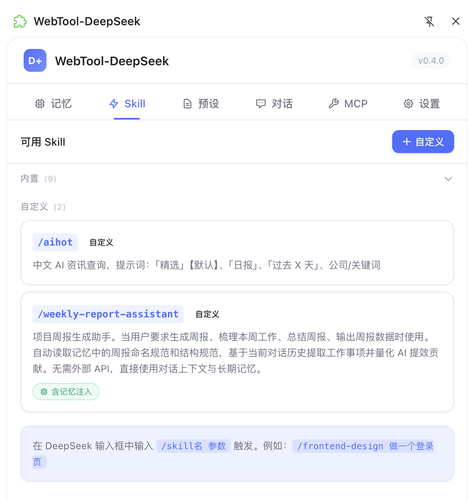
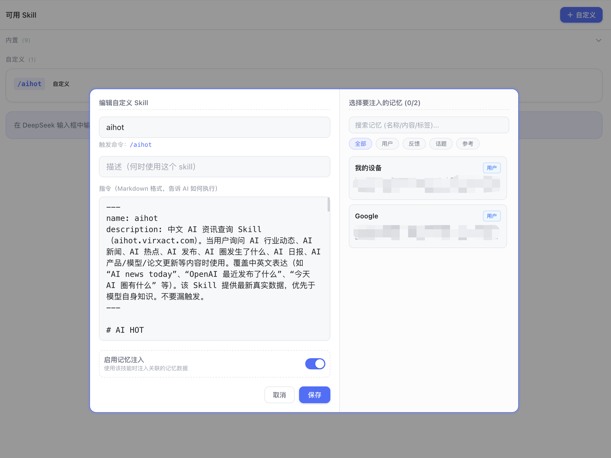
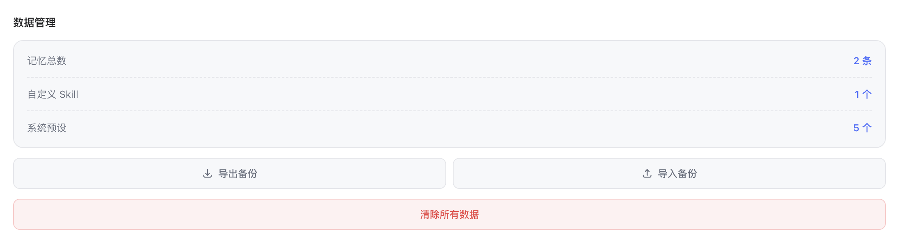
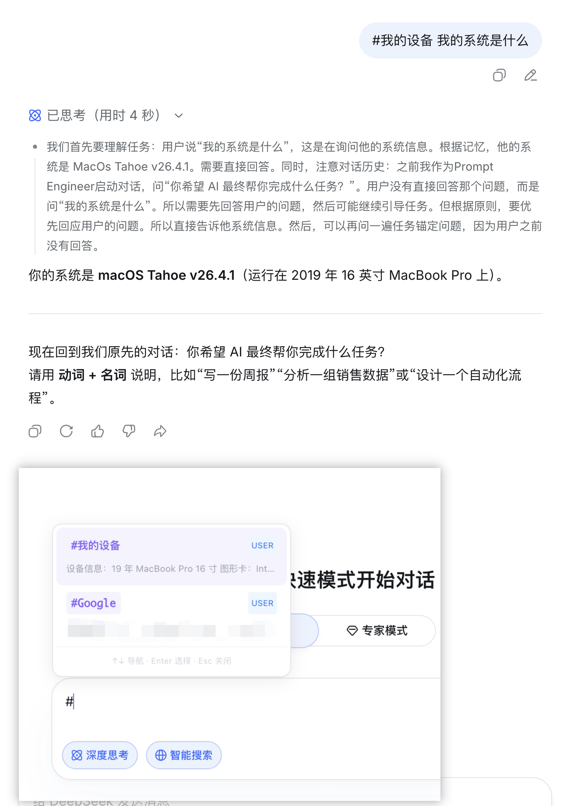
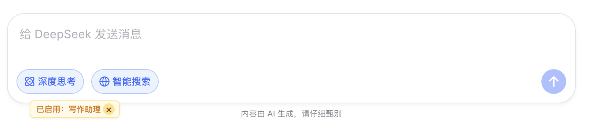

# WebTool-DeepSeek

为 [DeepSeek](https://chat.deepseek.com) 网页版注入 **Agentic 记忆系统**、**Skill 技能系统** 、 **系统提示词预设** 、**对话管理** 和 **Mcp 服务系统** 的 Chrome 扩展。

让 DeepSeek 拥有跨对话的长期记忆，通过 `/skill` 指令一键切换专家模式，并支持自定义系统提示词全局生效。

## 核心功能

### 类原生工具调用

- XML 工具协议 — 在 prompt 中向模型注入 `memory_save`、`memory_update`、`memory_delete` 等工具 schema，模型按 `<tool_name>{JSON}</tool_name>` 输出调用请求
- 流式拦截执行 — 扩展在 SSE 响应流中实时识别工具调用，转发给 Background 统一执行，不需要用户复制或手动确认
- 隐藏原始调用 — 页面不会暴露 XML/JSON 工具块；工具调用会从正文、历史消息和 IndexedDB 缓存中清理
- DeepSeek 观感 — 执行结果渲染成类似「已思考」的折叠区块
- 多工具连续执行 — 同一条回复可以执行多次工具调用，适合把多个独立事实分别保存为多条记忆
- 刷新后恢复 — 工具执行记录会短期持久化，并在刷新会话后恢复展示，避免刚执行完的工具状态消失
- 历史兼容 — 新 XML 协议和旧 DSML 工具调用历史都能被解析、清理和恢复

<p align="center">
  
</p>

### MCP 工具系统

- **支持多种 MCP 传输** — 支持 Streamable HTTP、HTTP POST、旧版 SSE、本地 stdio bridge 和 Chrome Native Messaging；浏览器不能直接启动 stdio 进程，因此 stdio 服务器需要通过本地 bridge 或 native host 转接
- **标准 MCP 生命周期** — 连接时执行 initialize / notifications/initialized，发现工具走 tools/list，调用工具走 tools/call
- **统一工具协议** — MCP 工具会转换为与记忆工具一致的 `ToolDescriptor`，注入 DeepSeek prompt 后由模型按 `<mcp_xxx>{JSON}</mcp_xxx>` 形式发起调用
- **服务级管理** — 侧边栏 MCP 分栏支持新增、编辑、启用/停用、删除服务，支持测试连接、刷新工具列表、查看已发现工具和最近调用记录
- **权限清晰可见** — HTTP/SSE/bridge 传输会在侧边栏按钮点击时请求对应 origin 的 Chrome host permission；本地服务推荐配置为 `http://127.0.0.1/*` 或 `http://localhost/*`
- **结果展示与历史** — DeepSeek 输出 MCP XML 工具块后，扩展会执行工具、隐藏原始 XML，并将执行结果展示为「已执行工具」折叠区块；工具调用历史会保存到 Chrome 本地存储
- **本地安全边界** — MCP 服务配置保存在 Chrome 本地存储；WebDAV 同步仍只同步记忆、Skill 和预设，不同步 MCP 配置或 secret
- **默认限制** — 连接超时 10s，请求超时 60s，发现超时 20s，单次结果上限 64KB，单服务工具上限 128 个；当前 UI 暴露服务基础配置，allowlist、headers、secret、timeout 等高级字段为底层类型预留
- **本地服务要求** — HTTP/SSE/Streamable HTTP 服务需要正确返回 CORS 头；Chrome host permission 负责扩展访问权限，CORS 仍由本地 MCP 服务端负责

### 记忆系统

- **自动记忆** — AI 在对话中识别到关键信息时，通过 tool_call 自动保存为长期记忆
- **智能注入** — 每次对话时，根据关键词匹配、置顶权重、访问频率等维度，自动筛选相关记忆注入 prompt
- **四种类型** — 用户画像 (`user`)、行为反馈 (`feedback`)、话题上下文 (`topic`)、参考资料 (`reference`)
- **侧边栏管理** — 查看、编辑、置顶、删除记忆，支持按类型筛选和标签管理
- **导入/导出** — JSON 格式批量备份和恢复

<p align="center">
  
</p>

### Skill 技能系统

- **内置技能** — 预设 8 个开箱即用的技能：记忆管理、极致深度思考、前端设计、文档协作、品牌指南、Skill 创建、算法艺术、PPT 设计
- **自定义技能** — 在侧边栏创建专属技能，定义系统指令和参数
- **`/` 触发** — 在聊天框输入 `/` 弹出自动补全面板，选择技能后自动注入对应的 system prompt
- **记忆联动** — 技能可选择是否同时注入记忆上下文

<p align="center">
  
  <br>
  
</p>

### 系统提示词预设

- **自定义预设** — 在侧边栏创建多个系统提示词预设，定义全局角色设定或行为指令
- **一键激活** — 同一时间只有一个预设处于激活状态，激活后自动生效
- **首条注入** — 每次新对话的首条消息前自动注入激活预设的内容，后续消息不重复注入
- **与技能/记忆共存** — 预设内容作为前缀注入，与 Skill 指令和记忆上下文叠加生效

### 工作原理

扩展在 main world 中拦截 `fetch` 和 `XMLHttpRequest`，在请求发送到 DeepSeek API 前修改 prompt（注入预设、记忆、技能指令和 tools schema），并解析 SSE 响应流以提取和处理 tool_call 指令。

```
用户输入 → 拦截请求 → 注入预设 + 记忆 + 技能指令 + tools schema → DeepSeek API
                                                                    ↓
页面折叠区块 ← 执行结果持久化 ← Background 执行工具 ← SSE 流式解析/隐藏工具调用
       ↓
侧边栏 ← IndexedDB/Chrome Storage ← 记忆/MCP/工具历史状态更新
```

工具调用链路分为三层：

1. Main World：拦截网络请求和响应流，收集完整回复，识别 XML 工具块，过滤页面可见文本。
2. Content Script：接收工具调用，渲染「已执行工具」折叠区块，并恢复刷新后的执行状态。
3. Background：统一执行本地记忆工具和 MCP 工具，持久化工具调用历史，并广播记忆、MCP 服务和工具目录状态更新。

## 二开能力

✅ 优化了新增、编辑表单样式、操作  
✅ 内置 Skill 增加折叠展开能力、自定义 Skill 现在可以手动编辑  
✅ Skill、预设新增编辑增加独立记忆能力选择列表、可搜索  
<p align="center">
  
</p>

✅ 数据管理导入导出新增自定义 Skill 与预设  
<p align="center">
  
</p>

✅ 增加记忆模块快捷选择 `#`  
<p align="center">
  
</p>

✅ 增加预设提示词快捷切换 `@`  
<p align="center">
  
</p>

✅ 优化启用的预设提示词用户感知  
<p align="center">
  
</p>

✅ 增加一键打包成完整的插件模式，下载即用  
✅ 导出备份可自定义选择模块数据【记忆、Skill、预设】  
✅ 新增对话管理，批量处理 DeepSeek 对话  
✅ 记忆【永久记忆、临时记忆、上下文对话记忆】、Skill【使用权重】、预设【使用权重】模块数据增加权重  
  - Skill、预设使用权重将会影响列表展示【分栏列表、输入框选择列表】

### 记忆权重

| 层级 | 定义 | 生命周期 | 示例 | 基础权重 |
|------|------|----------|------|----------|
| 永久数据 | 长期稳定、跨会话持续有效的信息 | 长期保留，默认不自动删除 | 用户身份、职业、偏好、长期项目背景、明确要求“记住”的信息 | 300 |
| 上下文对话数据 | 当前阶段、当前项目或近期讨论中有价值的信息 | 中期保留，随访问和时间动态调整 | 最近技术决策、当前任务约束、阶段性需求 | 180 |
| 临时数据 | 短期有效、一次性或低置信度信息 | 短期保留，主要通过低权重和预算控制减少注入 | 临时变量、单次实验结论、一次性链接 | 80 |

#### 注入策略

  记忆注入不只按权重排序，还要按 Token 预算分层截断。

推荐顺序：

1. 永久数据优先。
2. 当前输入关键词匹配的上下文对话数据优先。
3. 临时数据只在关键词命中或最近使用时注入。
4. 置顶数据永远进入候选集，但仍受总 Token 上限保护。

建议 Token 配额：

| 层级 | 默认配额 | 说明 |
|------|----------|------|
| 永久数据 | 40% | 保证用户画像和核心偏好稳定注入 |
| 上下文对话数据 | 45% | 服务当前任务和近期项目背景 |
| 临时数据 | 15% | 只保留短期相关信息 |

当某层没有可用数据时，剩余预算可流转给下一层。

#### 记忆归档策略

- 后台会定期归档长期未访问且访问次数较低的旧记忆
- 当前实现不按记忆层级承诺固定过期时间；临时数据是否进入 prompt 主要由权重、关键词命中和 Token 预算共同决定

## 安装

### 从源码构建

```bash
git clone https://github.com/illegal-xd/WebTool-DeepSeek.git
cd WebTool-DeepSeek
pnpm install
pnpm run build
```

1. 打开 Chrome，访问 `chrome://extensions/`
2. 开启右上角「开发者模式」
3. 点击「加载已解压的扩展程序」
4. 选择项目下的 `dist/chrome-mv3/` 目录

### 开发模式

```bash
pnpm run dev     # 启动开发服务器，支持热重载
pnpm run build   # 生产构建
pnpm run zip     # 打包为 .zip（用于发布）
pnpm run package # 打包并复制为 WebTool-DeepSeek.zip
pnpm run compile # TypeScript 类型检查
```

## 技术栈

| 层次 | 技术 |
|------|------|
| 框架 | [WXT](https://wxt.dev) (Chrome MV3) |
| UI | React 19 + Tailwind CSS 4 |
| 存储 | Dexie (IndexedDB) + Chrome Storage API |
| 语言 | TypeScript |

## 项目结构

```
core/
├── constants.ts          # API 地址、token 预算、系统模板
├── types.ts              # 类型定义
├── interceptor/          # 网络拦截（fetch hook、SSE 解析、tool_call 提取）
├── memory/               # 记忆系统（存储、评分筛选、prompt 注入）
├── tool/                 # 统一工具抽象（descriptor、解析、执行历史、runtime）
├── mcp/                  # MCP 服务配置、协议 client、工具发现和 transport
├── skill/                # 技能系统（内置技能、解析器、注册表）
├── preset/               # 系统提示词预设（存储、激活管理）
└── ui/                   # 技能自动补全弹窗

entrypoints/
├── background.ts         # Service Worker（消息路由、数据持久化）
├── content.ts            # Content Script（DOM 集成、tool_call 处理）
├── main-world.content.ts # Main World 脚本（网络拦截）
└── sidepanel/            # 侧边栏 React 应用（记忆/技能/预设/对话/MCP/设置页面）
```

## 友情链接

- [LINUX DO](https://linux.do) — 新一代开源技术社区

## License

MIT

## 其他说明

***本项目基于 [zhu1090093659/deepseek-pp](https://github.com/zhu1090093659/deepseek-pp) 项目二发，欢迎大家体验原版***
